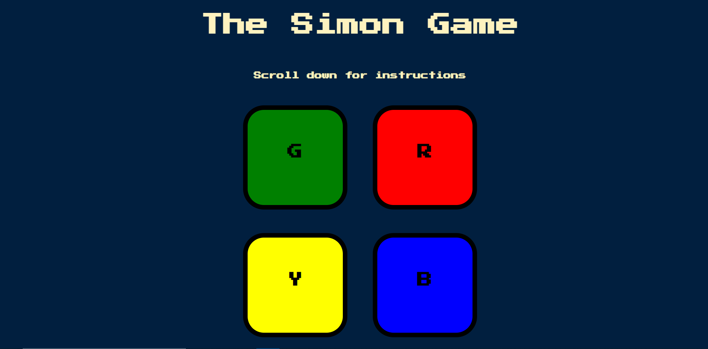

# The Simon Game
Want to put your memorizing skills to the test? Play this fun version of the memory game to find out!

Currently hosted on github pages

## Table of contents

- [Overview](#overview)
  - [The game](#the-game)
  - [Screenshot](#screenshot)
  - [Links](#links)
- [My process](#my-process)
  - [Built with](#built-with)
  - [Continued development](#continued-development)
  - [Useful resources](#useful-resources)
- [Author](#author)

## Overview

### The game

The player will be able to:
1. View the pattern given by the computer
2. Replicate the exact pattern by either clicking the buttons on the screen or the keyboard buttons

### Screenshot

A screenshot of the web page I made.

### Links

- Live Site URL: https://urmi-jana.github.io/The-Simon-Game/

## My process

### Built with

- Semantic HTML5 markup
- CSS custom properties
- JQuery fromework for Javascript

### Continued development

I would like to further work on:
1. Creating better and innovative web pages for users to enjoy

### Useful resources

- [JQuery Documentation](https://api.jquery.com/) - for info on JQuery functions

## Author

- LinkedIn - [@Urmi Jana](https://www.linkedin.com/in/urmi-jana-16b44b21b/)
